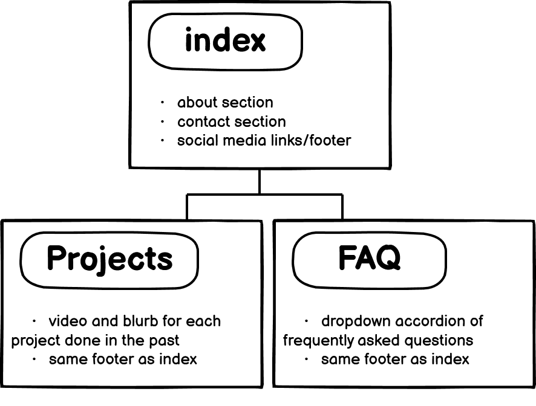
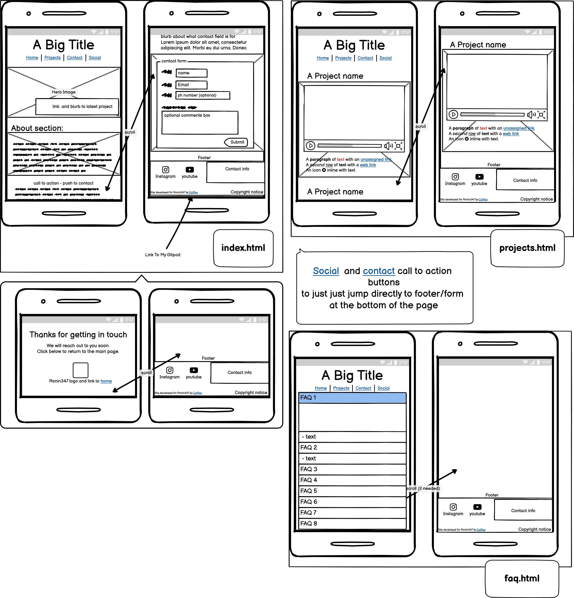
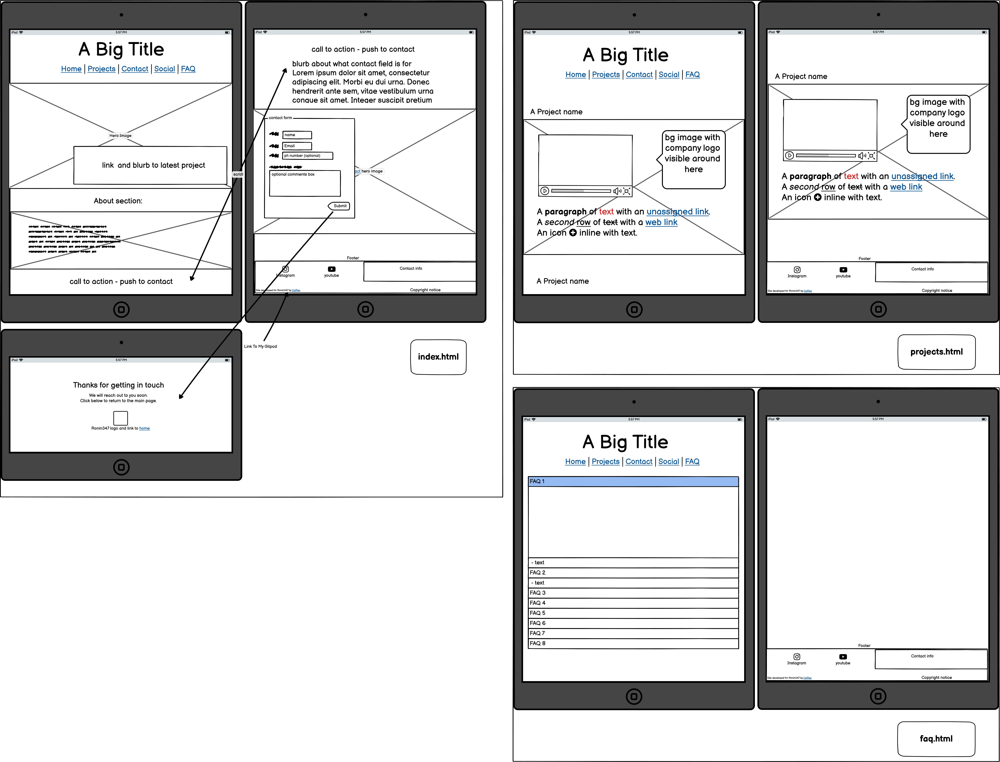
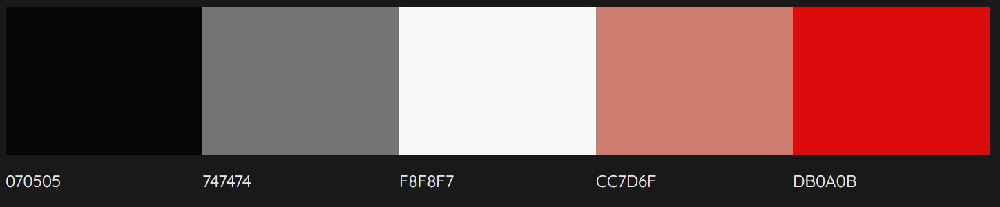
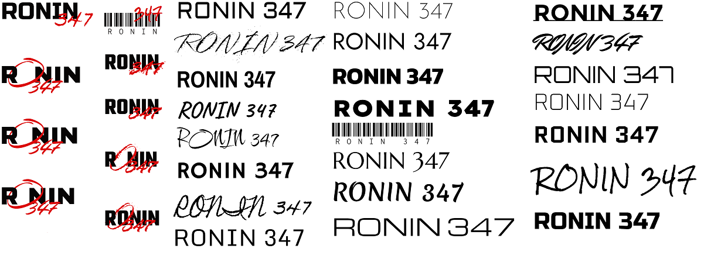

# RONIN 347
## Media Production and consultancy

 

# CONTENTS
1. INTRODUCTION
 

2. UX
   - stakeholder Interview
   - Competitor Review
   - Target Demographics
   - User Goals
   - Business Interview
   - Development planes
     - Strategy
     - Scope
     - Structure
     - Skeleton
       

3. Design
   - Colors
   - Typography
   - Imagery
     

4. FEATURES
   - Design Features
   - Home Page
   - Contact confrimation Page
   - Projects page
   - 404 Page
   - 500 Page
   - Features to implement in future
    

 5. BUGS
  

 6. TECHNOLOGIES
    - Languages used
    - Frameworks
    - Libraries
    - Programs
  

6. [TESTING](../milestone-p1-ronin347-media/testing.md)
  - is contained as a seperate document [here](../milestone-p1-ronin347-media/testing.md)
     

7. DEPLOYMENT
    - step by step guide on how to deploy
   

8. CREDITS
 

9. ACKNOWLEDGEMENTS
 

# INTRODUCTION

This website was developed for the media production company _Ronin347 Media_.
Ronin347 Media focuses on delivering bespoke and affordable media, mainly aimed at the fitness industry, through the use of empirical knowledge garnered from working in both the fitness industry and acting/performance world.
This website targets potential customers for Ronin347 as its main demographic. This would include; but not limited to:
 - Personal trainers
 - Fitness product owners
 - Small independent businesses
  

The concept for this build focuses on the existing media of Ronin347, creating an interactive portfolio and opportunity to contact. The focus is to showcase the quality of work created by Ronin347 in an accessible format that can be brought up on a phone during conversation, most likely out on a location or in a gym environment.
 
However; being a website, the site also contains features where visitors can contact the company.
 

As this Project has been primarily created for assessment purposes. The site utilizes a database storage link created by Code Institute, to allow for external working elements with regard to the contact form.
 

This project is the first of the five projects to be created for the Diploma in Full Stack Software Development (Common Curriculum).
 

In accordance with assessment guidance outlined by the Code Institute this project aims to achieve the following learning outcomes: 
 

**(_From the Code Institute Assessment Handbook for Portfolio Project 1_)**
 
 - "Design an interactive Front-End web application using HTML and CSS based on the principles of user experience design, accessibility and responsivity"
 - "Test a Front-End web application through the development, implementation and deployment stages"
 - "Deploy a Front-End web application to a Cloud platform"
 - "Maximize future maintainability through documentation, code structure and organization"
 - "Demonstrate and document the development process through a version control system such as GitHub"
  
 

# UX

## **| Stakeholder Interview |**
 

### **what are the main services of this company:**

<em>"Affordable cinematic promotional content for independent and small businesses, either narrative-based, documentary or tutorial content."</em>
 

###	**how does it differ from competitors:**

<em>“My background as an actor and my experience from being on film sets and some of the biggest theatre stages in the world allows me to bring the scale of that production rigour to smaller scale projects – industry leading standards for small scale businesses”</em>
 

### **What makes it special:**

</em>“my unique experience being on the other side of the camera and being in the clients position makes it easy for me to make them feel comfortable and relaxed. As an actor - I focus on the story they are trying to tell, so that the end product becomes a very personable and relatable narrative driven piece of media that demonstrates the real value of the client”</em>
 

###	**what would give him value by having this product out in the wild:**

<em>“have an online platform and online catalogue of resources that a client can easily access and see the quality and standard of work that I do, in addition to bridging the gap between ideas that I am verbally pitching to the client – as these could initially be quite grand, in terms of narrative, relatability and accessibility – having a visual representation would help consolidate ideas and pitches to clients. In addition to giving proof of that such ideas can be made real”</em>
 

### **What would add value to such a service:**

<em>“contact details, an faq would be really handy, anything to streamline initial dialogue and answer any questions prior to reaching out to me, other features like a gallery or a playlist of embedded videos would be ideal”</em>
  

## **| Competitor Review |**
 

### **https://www.christopherbailey.co.uk** 
does fitness photography and studio hire. Site has modern feel but a bit slow to load due to high amount of media, made as a desktop-first approach, some sizing could be done better.

#### **pros and cons of what they are doing**
**pros:**
* modern style focusing immediately on quality of work using content in design
* information is clear
* method of contact is clear

**cons:**
* enormous network payload
* limited alt text and labels
* some images not suitable at certain resolutions

#### **what are they missing**
* alt text and accessibility solutions

#### **what are they doing that could be done better**
* all of the cons listed are fairly simple fixes, down to webdesign.
  

### **https://www.matt-thomas-photography.co.uk/**
focus on bodybuilding photography. has a more simple/intuitive layout compared to the above

#### **pros and cons of what they are doing**
**pros**
* clean and modern feel
* draws immediate focus to quality of product
* big focus on call to action/booking

**cons**
* very high demand on browser due to high data payload of highres images 
* limited alt text
* a lot of information on the first page to digest

#### **what are they missing**
* alt text and accessibility solutions

#### **what are they doing that could be done better**
* images could be optimized for site to reduce site load
  

###	**https://1fitlife.com/**
focus on videography for fitness

#### **pros and cons of what they are doing**
**pros**
* index is concise with powerful imagery and good colourscheme
* links to partners and projects
* immediate method of contact

**cons:**
*	some imagery not optimized for web
*	some tooltips in all caps while others are not

####	**what are they missing**
*	congruence in some smaller elements

####	**what are they doing that could be done better**
*	some elements kind of sound the same, clearer titling or perhaps mergaing sections would be more ideal.
*	Fix imagery
  

# Development Planes

## **| Strategy Plane |**
 

### **Target Demographics**
Talking with the client the, the target Demographic/s for this business are:
* Small independent Businesses
* Personal Trainers
* Sports oriented therapists
* semi-professional Athletes

##  **User Stories**
 

### **Small Independent Businesses**
* _As a small business owner, I need to create some short instructional videos for our new staff in regard to some of our internal work systems_
*	_As a small business owner, I have a new product that I want to market and want to create some new media to promote this_
*	_As a small business owner, I want to know upfront how it will cost to create media for my potential projects_
* _As a small business owner, I want to document the development or trial run of a new product I am developing_

### **Personal Trainers**
*	_As a Personal trainer, I am looking to create a promotional video that I can advertise myself with online_
*	_As a personal trainer, I want to create a series of instructional workouts that I can sell in a package_

### **Sports Oriented Therapists**
* _As a Sports Oriented Therapist, i am looking to create some video media for my own website that demonstrates my specific services_

### **Semi-Professional Athletes**
* _As a Semi-professional Athelete, I want to document a trial or challenge that I am training for, which I can then publish or blog about._

## **Based on the User Goals, this website needs to achieve the following:**
* Demonstrate what this company does
* Showcase skills and portfolio of the company
* Show Pricing of different types of projects and packages
* answer any initial queries about creating such projects with the company
* Get in touch with the company to start a dialogue

## **Based on the stakeholder goals, this website needs to achieve the following:**
* inspire site visitors to contact the company
* answer any frequently asked questions prior to contacting
* Showcase previous work with partners and affiliates
* Link to existing partners to show ongiong healthy business relationships
  

## **| Scope Plane |**
 

Using goals discerned in the strategy plane, site features have been categorised into _Content_ and _Functional_ requirements:
 

**Content Requirements**
* Portfolio of existing content
* FAQ
* Pricelist
* Contact Form
* Links to affiliates
 

**Functional Requirements**
* Straightforward navigation
* linear narrative that leads to starting a dialogue
* concise information
* Immediate demonstration of value
  

## **| Structure Plane |**

Given the Above information. Site structure was created with the focus of immediate demonstration of product value, which then leads to a point of contact, with an FAQ and Project Library supplementing the main page:
Site structure created in [Balsamiq](https://balsamiq.com/)
 

 

As the project developed, and after numerous meetings with the client business, the structure expanded and augmented to suit the client needs. As such, additional pages were added and names amended to suit the the purpose of the pages:
 - pages amended
   - Projects: renamed to portfolio
 - pages added
   - contact:
     - almost identical design to the contact section of the index, but now on it's own page due to evolution of the project (originally removed as per request of client, later re-instated for assessment purposes)
   - about:
    - The main page - as it was being built, begun to look too wordy. A decision was made to split the content into it's own page using the existing style created for all pages
      

## **| Skeleton Plane |**
 

Wireframes for the site were created in [Balsamiq](https://balsamiq.com/). Given that the company has high face-to-face interaction with potential clients on a daly basis, a mobile-first approach was adopted:

_smartphone wireframes_

_Tablet Wireframes_

_Desktop/Laptop Wireframes_

 

 - Contact information in the footer was removed in the final product at the wishes of the client.
 - Given that the site was taking a mobile first approach, the menu was revised during development so that accessability to all site areas was maximised without comprimising on display content. As such, a `fixed` `nav` expanding burger button was created for the top left corner, banner `nav` was removed.
 - FAQ was changed from a ropdown menu to visible blocks, as there wasn't enough content on the page to necessitate compartmentalising of information
 - due to time constraints, a contact confirmed page was never created, instead, the code institute form-dump link was used [https://formdump.codeinstitute.net/](https://formdump.codeinstitute.net/).
 - the link to the latest project button was updated to be an extra portfolio link, as the hero image became a video
 - the portfolio link was then moved to the left of the page so as to not clash with the `fixed` nav bar which is aligned right
 - the title on the index page was animated to disappear upon the video hero loading, as the video contains branding (index only)
  

## Design

### Colors

The client's Original Logo was taken as inspiration to create a color palette for the site. the image was ran through [Colorimind.io](http://colormind.io/) to create a color palette

### typography

Taking the old Logo as a reference, Fonts were sampled from [Google fonts](https://fonts.google.com/) and new logo samples were created from the selected fonts. As the Original Logo fonts had specific rights reserved by the author, they could not be embedded within a website.

### Imagery

# FEATURES

# BUGS
* navigation buttons not responding to hover
  * error in code targeting wrong element
* Main page video hero image not fitting in container
  * fixed with 3rd party code benmarshall.me
* hero video not adapting to smaller screen sizes
  * resolved by adjusting with media queries
* navigation button on smaller screens has an unwanted line solid white line that appears
  * fixed by adding positioning media query in navigation class
* media queries for screen widths of 800px~ not working
  * resolved by identifying conflict in pre-existing media queries
* about-bg animation frame jittery and not static on resolutions narrower than 1000px
  * vertical edges hidden with ink partition design
  * black background added to smaller resolutions to hide jittery horizontal borders on animation
  * bug and solution now obselete as structure of website changed to grid display
* contact box exceeding viewport width when inder 950px~
  * resolved by changing form padding to % from px variable
  * contact box now removed, bug and solution no longer relevant
* contact box background overlapping ink partition even though overflow rule set
  * solved by adding a top border to hide the break in black background and ink partition
* Links in nav not clickable
  * resolved by re-working nav bar to use Javascript from W3schools
* some images not loading after first deployment:
  * filepaths were absolute, changed to relative.
* scroll bar toggling repeatedly on 404
  * fixed with 3rd party code found on stack overflow: https://stackoverflow.com/questions/28411499/disable-scrolling-on-body 
  

# TECHNOLOGIES

# TESTING

# DEPLOYMENT

# CREDITS

Video iframe on main page
https://www.benmarshall.me/responsive-iframes/

creating and uploading favicon:
https://www.lcn.com/blog/beginners-guide-favicons/- instructions on how to implement favicon
http://faviconer.com/ - for creating favicon

# ACKNOWLEDGEMENTS

