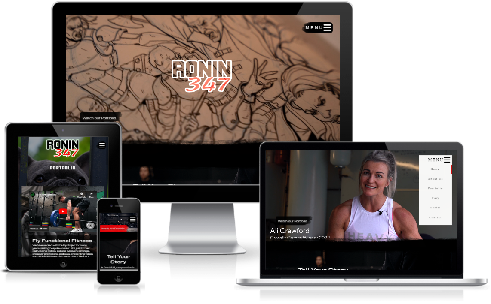
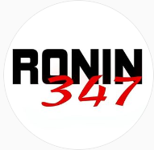

# RONIN 347
## Media Production and Consultancy

 

# CONTENTS
1. [INTRODUCTION](#introduction)
 

2. [UX](#ux)
   - Stakeholder Interview
   - Competitor Review
   - Target Demographics
   - User Goals
   - Business Interview
   - Development Planes
     - Strategy
     - Scope
     - Structure
     - Skeleton
       

3. [DESIGN](#design)
   - Colors
   - Typography
   - Imagery
     

4. [FEATURES](#features)
   - Design Features
   - Index Page
   - About Page
   - Portfolio page
   - FAQ Page
   - Contact Page
   - 404 Page
   - 500 Page
   - Features to Implement in Future
    

 5. [BUGS](#bugs)
   - Resolved Bugs
   - Unresolved Bugs
  

 6. [TECHNOLOGIES](#technologies)
    - Languages Used
    - Frameworks
    - Libraries
    - Programs
  

6. [TESTING](testing.md)
  - Contained as a seperate document [here](testing.md)
     

7. [DEPLOYMENT](#deployment)
    - Step-by-step guide on how to deploy
   

8. [CREDITS](#credits)
 

9. [ACKNOWLEDGEMENTS](#acknowledgements)
 

# INTRODUCTION

This website was developed for the media production company _Ronin347 Media_.
Ronin347 Media focuses on delivering bespoke and affordable media, mainly aimed at the fitness industry, through the use of empirical knowledge garnered from working in both the fitness industry and acting/performance world.
This website targets potential customers for Ronin347 as its main demographic. This would include - but not limited to:
 - Personal trainers
 - Fitness product owners
 - Small independent businesses
  

The concept for this build focuses on the existing media of Ronin347, creating an interactive portfolio and opportunity to contact. The focus is to showcase the quality of work created by Ronin347 in an accessible format that can be brought up on a phone during conversation, most likely out on a location or in a gym environment.
 
However, being a website, the site also contains features where visitors can contact the company.
 

As this Project has been primarily created for assessment purposes. The site utilizes a database storage link created by Code Institute, to allow for external working elements with regard to the contact form.
 

This project is the first of the five projects to be created for the Diploma in Full Stack Software Development (Common Curriculum).
 

**(_From the Code Institute Assessment Handbook for Portfolio Project 1_)**
 

 - "Design an interactive Front-End web application using HTML and CSS based on the principles of user experience design, accessibility and responsivity"
 - "Test a Front-End web application through the development, implementation and deployment stages"
 - "Deploy a Front-End web application to a Cloud platform"
 - "Maximize future maintainability through documentation, code structure and organization"
 - "Demonstrate and document the development process through a version control system such as GitHub"
  
 

# UX

## **| Stakeholder Interview |**
 

### **what are the main services of this company:**

<em>"Affordable cinematic promotional content for independent and small businesses, either narrative-based, documentary or tutorial content."</em>
 

###	**how does it differ from competitors:**

<em>“My background as an actor and my experience from being on film sets and some of the biggest theatre stages in the world allows me to bring the scale of that production rigour to smaller scale projects – industry leading standards for small scale businesses.”</em>
 

### **What makes it special:**

</em>“My unique experience being on the other side of the camera and being in the client’s position makes it easy for me to make them feel comfortable and relaxed. As an actor - I focus on the story they are trying to tell, so that the end-product becomes a very personable and relatable narrative driven piece of media that demonstrates the real value of the client.”</em>
 

###	**what would give him value by having this product out in the wild:**

<em>“Have an online platform and online catalogue of resources that a client can easily access and see the quality and standard of work that I do, in addition to bridging the gap between ideas that I am verbally pitching to the client – as these could initially be quite grand, in terms of narrative, relatability and accessibility – having a visual representation would help consolidate ideas and pitches to clients. In addition to giving proof of that such ideas can be made real.”</em>
 

### **What would add value to such a service:**

<em>“Contact details, an FAQ would be really handy, anything to streamline initial dialogue and answer any questions prior to reaching out to me, other features like a gallery or a playlist of embedded videos would be ideal.”</em>
  

## **| Competitor Review |**
 

### **https://www.christopherbailey.co.uk** 
Does fitness photography and studio hire. Site has modern feel but a bit slow to load due to high amount of media, made as a desktop-first approach, some sizing could be done better.

#### **Pros and cons of what they are doing**
**Pros:**
* Modern style focusing immediately on quality of work using content in design
* Information is clear
* Method of contact is clear

**Cons:**
* Enormous network payload
* Limited alt text and labels
* Some images not suitable at certain resolutions

#### **What are they missing**
* Alt text and accessibility solutions

#### **What are they doing that could be done better**
* All of the cons listed are fairly simple fixes, down to webdesign
  

### **https://www.matt-thomas-photography.co.uk/**
Focus on bodybuilding photography. Has a more simple/intuitive layout compared to the above

#### **Pros and cons of what they are doing**
**Pros**
* Clean and modern feel
* Draws immediate focus to quality of product
* Big focus on call to action/booking

**Cons**
* Very high demand on browser due to high data payload of high-res images 
* Limited alt text
* A lot of information on the first page to digest

#### **What are they missing**
* Alt text and accessibility solutions

#### **What are they doing that could be done better**
* Images could be optimised for site to reduce site load
  

###	**https://1fitlife.com/**
Focus on videography for fitness

#### **Pros and cons of what they are doing**
**Pros**
* Index is concise with powerful imagery and good colour scheme
* Links to partners and projects
* Immediate method of contact

**Cons:**
* Some imagery not optimized for web
* Some tooltips in all caps while others are not

####	**What are they missing**
*	Congruence in some smaller elements

####	**What are they doing that could be done better**
* Some elements kind of sound the same, clearer titling or perhaps merging sections would be more ideal
* Fix imagery
  

# Development Planes

## **| Strategy Plane |**
 

### **Target Demographics**
Talking with the client the, the target Demographic/s for this business are:
* Small independent Businesses
* Personal Trainers
* Sports oriented therapists
* semi-professional Athletes

##  **User Stories**
 

### **Small Independent Businesses**
* _As a small business owner, I need to create some short instructional videos for our new staff in regard to some of our internal work systems._
* _As a small business owner, I have a new product that I want to market and want to create some new media to promote this._
* _As a small business owner, I want to know upfront how it will cost to create media for my potential projects._
* _As a small business owner, I want to document the development or trial run of a new product I am developing._

### **Personal Trainers**
* _As a Personal trainer, I am looking to create a promotional video that I can advertise myself with online._
* _As a personal trainer, I want to create a series of instructional workouts that I can sell in a package._

### **Sports Oriented Therapists**
* _As a Sports Oriented Therapist, I am looking to create some video media for my own website that demonstrates my specific services._

### **Semi-Professional Athletes**
* _As a Semi-professional Athlete, I want to document a trial or challenge that I am training for, which I can then publish or blog about._

## **Based on the User Goals, this website needs to achieve the following:**
* Demonstrate what this company does
* Showcase skills and portfolio of the company
* Show Pricing of different types of projects and packages
* Answer any initial queries about creating such projects with the company
* Get in touch with the company to start a dialogue

## **Based on the stakeholder goals, this website needs to achieve the following:**
* Inspire site visitors to contact the company
* Answer any frequently asked questions prior to contacting
* Showcase previous work with partners and affiliates
* Link to existing partners to show on-going healthy business relationships
  

## **| Scope Plane |**
 

Using goals discerned in the strategy plane, site features have been categorised into _Content_ and _Functional_ requirements:
 

**Content Requirements**
* Portfolio of existing content
* FAQ
* Pricelist
* Contact Form
* Links to affiliates
 

**Functional Requirements**
* Straightforward navigation
* Linear narrative that leads to starting a dialogue
* Concise information
* Immediate demonstration of value
  

## **| Structure Plane |**

Given the Above information, site structure was created with the focus of immediate demonstration of product value, which then leads to a point of contact, with an FAQ and Project Library supplementing the main page:
Site structure created in [Balsamiq](https://balsamiq.com/)
 

 

As the project developed, and after numerous meetings with the client business, the structure expanded and augmented to suit the client needs. As such, additional pages were added, and names amended to suit the purpose of the pages:
 - **Pages amended**
   - Projects: renamed to “Portfolio”
 - **pages added**
   - Contact:
     - Almost identical design to the contact section of the index, but now on its own page due to evolution of the project (originally removed as per request of client, later re-instated for assessment purposes).
   - About:
    - The main page - as it was being built, begun to look too wordy. A decision was made to split the content into its own page using the existing style created for all pages.
      

## **| Skeleton Plane |**
 

Wireframes for the site were created in [Balsamiq](https://balsamiq.com/). Given that the company has high face-to-face interaction with potential clients on a daily basis, a mobile-first approach was adopted:

_smartphone wireframes_

_Tablet Wireframes_

_Desktop/Laptop Wireframes_

 

 - Contact information in the footer was removed in the final product at the wishes of the client.
 - Given that the site was taking a mobile first approach, the menu was revised during development so that accessibility to all site areas was maximised without compromising on display content. As such, a `fixed` `nav` expanding burger button was created for the top left corner, banner `nav` was removed.
 - FAQ was changed from a dropdown menu to visible blocks, as there wasn't enough content on the page to necessitate compartmentalising of information.
 - Due to time constraints, a contact confirmed page was never created, instead, the code institute form-dump link was used. [https://formdump.codeinstitute.net/](https://formdump.codeinstitute.net/).
 - The link to the latest project button was updated to be an extra portfolio link, as the hero image became a video.
 - The portfolio link was then moved to the left of the page to not clash with the `fixed` nav bar which is aligned right
 - The title on the index page was animated to disappear upon the video hero loading, as the video contains branding (index only).
   

# Design

## **| Colors |**

The client's Original Logo was taken as inspiration to create a colour palette for the site. the image was ran through [Colorimind.io](http://colormind.io/) to create a colour palette.

 

The Palette was used as a guide to create colours, while the red and pink and off-white were adopted into the style, a solid black (#000000) was decided upon for easy implementation of external artwork and design features created outside of Git.
  

### **| typography |**

Taking the old Logo as a reference, Fonts were sampled from [Google fonts](https://fonts.google.com/) and new logo samples were created from the selected fonts. As the Original Logo fonts had specific rights reserved by the author, they could not be embedded within a website (as text, placed within an image was allowed).

After much deliberation, it was decided to keep the logo as an image and use the following samples to derive usable fonts for the text and headings of the site.

The final choices from the shortlist of fonts were:

| 'Teko' for `H1` | 'Michroma' for `H2` | 'Montserrat' for `body` |
| --------------- | ------------------- | ----------------------- |
|  |  |  |

Given the client's interest in Japanese culture, and, to match the brand name, it was decided that the navigation menu should resemble somewhat of a Sashimono banner.

To attempt to adopt this kind of style while giving the page a more modern look (which more aligns with the content), many serif fonts were experimented with. after a lot of painstaking deliberation, 'Times New Roman' fit the style the most.

|Example of Sashimono Banner from [The MET Museum](https://www.metmuseum.org/art/collection/search/23882)| Depiction of Sashimono banner sourced from [alamy.com](https://www.alamy.com/stock-photo/sashimono.html) | Rendition on site |
| ----- | ----- | ----- |
| |  |  |
 

### **| Imagery |**
 

Fortunately, all photographic imagery was supplied by the client. so full consent for all imagery has been given.
Anything that wasn't supplied by the client was created in Apple Procreate, MS PowerPoint, MS Paint and GIMP.

[ink line used to partition elements, as an example.](assets/images/site-wide/ink-partition.webp)
  

# FEATURES

### **Consistent Design Features**
The following Design features are prevalent across all pages except for the 404 and 500 pages (and the index page with regard to the page header)
- **Background:** Background on all pages has a slow 30 second animation where the background image scales down from `scale(1.1)` to `scale(1)` to give the site a cinematic feel.
   - Backgrounds will also adjust to make sure desire focal point of image is always visible (where possible).
     

- **header:** Contains the company logo and an `h1` title separated with a grid feature. This allows for a responsive design. The text adjusts to fit all tested screen sizes and logo always adjusts to fit within the viewing screen.
  

- **Navigation:** The Navigation element resides within a button that remains in a `fixed` position, regardless of the page being scrolled. This means users can always access the navigation menu with a click or tap, optimising user call-to-action and accessibility. The button also adjusts in size below resolutions under 1000px and becomes more compact to accommodate the drop and change in orientation of viewport real estate.
   - when clicked, the navigation menu expands into a vertical banner, each link is responsive with slow expanding text to let the user know that the element is clickable/interactive.
     

- **Body** text: Except for the index page (at resolutions above a `max-width` of 900px), there is a blurred opaque background on all text boxes to ensure legibility and easy reading of all text.
  

- **Footer:** The footer is at the bottom of all conventional pages. It contains responsive social media buttons that highlight in the relevant social media brand colours when hovered over. 
   - A placeholder link is being used for twitter. As the client has not yet created a business twitter account. For assessment purposes it has remained on the page and is linked to the front page of [twitter](https://twitter.com/).
   - The YouTube links directly link to the client's YouTube channel. But at this moment they have yet to upload any public material.
   - All social media links open in separate tabs
   - There is also a link to the author's GitHub in the bottom left, and copyright information on the right. 
     

### **Index Page**
When this page loads, it first loads the background and body text, then after 1 second, the hero video scrolls down from the top, followed by swiping animation entry of the navigation button and portfolio button. This give the user a peak of the body text of the page, prompting the understanding that the page can be scrolled. This is especially useful, as on landscape devices, most of the time the hero banner will take up near all of the viewport. 
another minor prompt is added with the use of the ink partition along the bottom of the video, further implying there is more below the hero video.
  

 - **Hero Video**
   - kept under 50mb to ensure web optimisation
     

 - **Watch our portfolio**
   - This alternative link to the portfolio appears on the bottom left of the hero video. This button is placed to piggyback off any interest piqued by the hero video upon the page loading, possible prompting users to immediately take a look at more project samples. 
   - The button responsive to lower screen resolutions. On mobile, it changes to a red ink splash instead of black and aligns to the bottom right of the video. Changing it to a link that can be tapped and avoid a hover animation that would be obsolete on a touchpad device. 
     

 - **Tell your Story**
   - This introductory page text gives a brief overview of the purpose of this site; it also gives prompts to different sections in the site with their intended use. links to the pages are also embedded in the body text in addition to the navigation bar for further call to action.
   - This section's margins adjust to always show the focal point of the background image. when this no longer becomes possible, a blurred background appears in the `div` housing the text to improve legibility. 
     

### **About Page**
This page uses a responsive grid layout that has a landscape design for larger screens and a portrait design for narrower screens. Images shift to accommodate the layout adjustment. all other features have already been listed in the **Consistent Design Features** section.
  

### **Portfolio page**
This page consists of multiple grids stacked as block elements to give a strong pattern and continuity with other pages. Like the About page, this page has landscape focused grids for each block which adjust to portrait orientation as necessary when resolution shifts. Each Section contains branding or a background representing the company/person or topic it is about.
  - all videos on this page are sourced from the client's YouTube
  - videos are embedded from YouTube in `iframe`s
  - videos embedded into frames allows for responsive aspect ratio on videos as resolution adjusts
    

### **FAQ Page**
The most straightforward of all pages. Following the site wide design, each Question is placed in a margined block element, complete with all **Consistent Design Features** listed.
  

### **Contact Page**
This page contains a singular block element housing the contact form to have some congruence with site design. When a `text` input or `textarea` field is in `focus`, the style of the field changes to match the navigation button style when it is in `focus`. The Button to submit the form also adopts the same styling, but on `hover` instead of `focus`.
  - **Contact form**
   - Original contact form was sourced directly from the [Code Institute Love running Project](https://github.com/Code-Institute-Org/love-running-2.0) when walkthrough was being conducted prior to this project. Style and structure was used as a basline, then fields were changed and re-styled to fit the pages needs.
   - Both the name and email field require information to be entered
   - The email field will only accept a valid email
   - Form data is posted to [https://formdump.codeinstitute.net/](https://formdump.codeinstitute.net/) for assessment purposes.
     

### **404 Page**
Following a different, but simplistic style to the rest of the site. This page calls to a meme that the client finds amusing. the page is simplistic, it displays the 404 error, then after 1 second, the [Pot of Greed](assets/images/404-500/pot-of-greed.png) card is "played" on the page. It glows with a yellow border and scales slightly in size on `hover` to signify to the user that it is an interactive element. The prompt on the page – and the card, tells the user to click it to return to the homepage. The card image is anchored to the Index.
 - This image was bought royalty free on [sketchfab.com](https://sketchfab.com/3d-models/pot-of-greed-yugioh-049d734aa46845ec9f74a5d2a8a16b05) ([proof of purchase](assets/images/readme/pot-of-greed-pop.png)) and then edited into a card style using MS PowerPoint and MS Paint.
   

### **500 Page**
Shares all same design features as 404, only one line of text is changed.
  

## **| Features to implement in future |**
After testing and discussion with test users, the following features may be implemented int he future:
- Add more transitions into the loading of background images and general site imagery to make the loading experience appear smoother.
- Find a method to implement some adaptable styling to individuals who may access the page using a "dark-reader" extension on their browser, so that the darker background images are not blacked out.
- More appropriate images could be used in the future or the pages. More pictures of the client doing some filming, however media like this was not available at time of development.
- Add a testimonials page separate from the portfolio page.
- Add a more in-depth contact form, may contain field such as "project details", "budget" and "length of project".
- When adding a more complex form, adding a simple contact button for general queries could also be useful.
- Add icons that consolidate what is being explained int he introductory text on the index. adding visual aid to the text and more clearly highlighting the services of the business.
- In the future maybe implement some more JavaScript to improve the smoothness of some of the animated elements.
  

# BUGS

## **Resolved Bugs**
**Navigation buttons not responding to hover**
- Error in code targeting wrong element

**Main page video hero image not fitting in container**
- Fixed with 3rd party code by [Ben Marshall](https://www.benmarshall.me/responsive-iframes/)

**Hero video not adapting to smaller screen sizes**
- Resolved by adjusting with media queries
- Bug now obsolete after implementing code from [Ben Marshall](https://www.benmarshall.me/responsive-iframes/)

**Navigation button on smaller screens has an unwanted line solid white line that appears**
- Fixed by adding positioning media query in navigation class.

**Media queries for screen widths of 800px~ not working**
- Resolved by identifying conflict in pre-existing media queries.

**About-bg animation frame jittery and not static on resolutions narrower than 1000px**
- Vertical edges hidden with ink partition design
- Page redesigned, bug now obsolete.

**Black background added to smaller resolutions to hide jittery horizontal borders on animation**
- Bug and solution now obselete as structure of website changed to grid display.

**Contact box exceeding viewport width when inder 950px~**
- Contact form completely rebuilt, issue no longer persists.

**Contact box background overlapping ink partition even though overflow rule set**
- Solved by adding a top border to hide the break in black background and ink partition
- Issue obsolete when page design restructure with `grid` CSS formatting.

**Links in nav not clickable**
- Resolved by re-working nav bar to use Javascript from [W3schools](https://www.w3schools.com/howto/howto_js_accordion.asp).

**Some images not loading after first deployment:**
- Filepaths were absolute, changed to relative.

**Scroll bar toggling repeatedly on 404**
- Fixed with 3rd party code found on [Stack Overflow](https://stackoverflow.com/questions/28411499/disable-scrolling-on-body)

**Navigation bar preventing interaction with rest of site due to higher `z-index`**
- Fixed by implementing `pointer-events: none` to Nav element and `pointer-events: auto` to child elements of nav.
  

**Hero video freezing and not playable on iOS devices**
- Resolved by adding `playsinline` to the `video` tag.

## **Unresolved Bugs**

**Index video does not autoplay on safari/iOS devices**
- Tried resolving this with various suggestions across the internet. The common solution was to add `playsinline` to the `video` tag, however, while this makes the video playable, it does not enable an autoplay function.
- There were further suggestions on [Stack Overflow](https://stackoverflow.com/) saying the video must be `muted`, but the `video` has always contained this tag.

**Alignment and styling for screenwidth's below 300px**
- Upon the last revision of the site body style, the background of the `div`s misaligns with the text when going below a width of 300px. While this could be fixed in the future easily with media queries, there was not enough time to fix this issue before the project submission date.

**Some animations clip if hovered right on the edge of the element for too long**
- Because a lot of the transitions and animations rely on changing of padding or changing absolute/relative position, animations can clip and repeat until un-hovered, if hovered over the correct/incorrect point for too long.
- Elements effected:
  - Navigation button
  - Index hero portfolio button when on desktop resolution
  - Pot of Greed card on 404 and 500 pages

**Index logo appearing/disappearing when manually resizing window**
- Due to the transition animation assigned to the logo element, when manually sizing the page window, the logo can randomly appear and then fade, but due to the alignment (why it disappears in the first place), it overlaps other elements briefly before disappearing. There was not enough time before the project submission date to further investigate this issue.
  

# TECHNOLOGIES

### **Main Languages used**

- [CSS3](https://en.wikipedia.org/wiki/CSS)
- [HTML5](https://en.wikipedia.org/wiki/HTML5)
- [Markdown](https://en.wikipedia.org/wiki/Markdown)
  

### **Frameworks | Libraries | Programs**
 

**[GitHub](https://github.com/)**
- Used to store, deploy and publish site.
  

**[GitPod](https://gitpod.io/)**
- Used to write and preview code, commit and push to GitHub.
  

**[Google Chrome](https://www.google.co.uk/chrome)**
- Used developer tools to check site responsiveness, preview site outside of GitPod, preview and make minor tweaks in real time to code without messing up original code during development.
  

**[W3C Markup Validation Service](https://validator.w3.org/)**
- Used to validate and format code.

**[Apple Procreate](https://apps.apple.com/gb/app/procreate/id425073498)**
- Used to create the ink line used for partitions and the background for buttons
  

**[GIMP - GNU Image Manipulation Program](https://www.gimp.org/)**
- Used to convert images to .WEBP format.

**[MS Word](https://www.microsoft.com/en-us/microsoft-365/word)**
- Used to spellcheck and format text.
  

**[MS Paint](https://apps.microsoft.com/store/detail/paint/9PCFS5B6T72H?hl=en-us&gl=us)**
- Used to make 404/500 image.
  

**[MS PowerPoint](https://www.microsoft.com/en-us/microsoft-365/powerpoint)**
- Used to make 404/500 image.
  

**[ScreenRec](https://screenrec.com/)**
- Used to capture screen recordings of live site testing for testing.md.
  

**[Cloud Converter](https://cloudconvert.com/mp4-to-gif)**
- Used to convert screen captures into gifs to reduce file size in repo and [testing.md](testing.md).
  

**[Opera](https://www.opera.com/)**
- Used to test UX.
  

**[Firefox](https://www.mozilla.org/en-GB/firefox/new/)**
- Used to test UX.
  

**[Balsamiq](https://balsamiq.com/)**
- Used to create site wireframes.
  

**[Google Fonts](https://fonts.google.com/about)**
- Used to implement custom/bespoke fonts to site text and headings.
  

**[Fontawesome](https://fontawesome.com/)**
- Used to implement Custom Icons for social media links and also navigation button.
  

**[amiresponsive](https://ui.dev/amiresponsive)**
- Used to create Example image at top of the [readme.md](#contents)

## [TESTING](https://github.com/Cal-Rex/milestone-p1-ronin347-media/blob/main/testing.md#-index- "click here to jump to the testing.md") - Click to jump to the testing.md.

# DEPLOYMENT
This Site was created, developed, managed and stored on GitHub and GitPod.

The site is deployed on GitHub Pages, the following steps can be replicated to achieve the same result:
1. Sign up/create an account with GitHub (or log in with existing details).
2. Locate this repository (repo) by using the _search_ function.
3. once clicked into the repo, click the settings cogwheel at the top right of the project.
4. Navigate to the pages section.
5. Navigate to source, select `main` from the dropdown menu to designate what branch to deploy.
6. Once this has been selected, the page will refresh, and the site will begin to deploy. This could take some time.
7. Once the page has been deployed you will be able to see it on the right-hand side of the main repo page.
8. You can click into the deployment page and then click "view deployment" to get the deployed link.

# CREDITS

Content and Media:
All Main media not created by myself was contributed by [Ronin347 Media © 2022](https://cal-rex.github.io/milestone-p1-ronin347-media/index.html)

Video iframe on main page:
[Ben Marshall](https://www.benmarshall.me/responsive-iframes/)

creating and uploading favicon:
[lcn](https://www.lcn.com/blog/beginners-guide-favicons/) - instructions on how to implement favicon
[faviconer.com](http://faviconer.com/) - for creating favicon

Javasciript to make interactive navigation button:
[w3schools: how to make an accordion](https://www.w3schools.com/howto/howto_js_accordion.asp)

Initial Contact form structure in addition to hosting a database to `post` form data to: 
[Code Institute GitHub repo for Love Running](https://github.com/Code-Institute-Org/love-running-2.0)
[Code institute](https://codeinstitute.net/) - https://formdump.codeinstitute.net/ 

Code:
The following sites were used as general rsources and reference for correct writing of code:
[Stack Overflow](https://stackoverflow.com/)
[W3Schools](https://www.w3schools.com/)
[css-tricks](https://css-tricks.com/)
[Adam-p on Github](https://github.com/adam-p/markdown-here)
[google.com](google.com)

# ACKNOWLEDGEMENTS

- Many thanks to every individual on slack who helped tackle the bugs on my site as they cropped up.
- Thank you to Chris Williams for helping me with placing my `<script>`.
- Thank you to Lucy Woodman who helped me understand linking headings in markdown.
- Thank you to Christina Myrvold for her meticulous critique of features on the site.
- Thank you to Sarah Breen and Gemma Hammil, who tested the site rigorously on iOS devices.
- Thank you to Code institute student care team for accommodating an extension on my time due to Covid-19.
- Thank you to my partner for her patience with my obsessiveness over this project.
- Many thanks to My mentor Seun, for her guidance throughout this project.