# Ronin 347 Media
## Testing

## Contents

1. User Stories
  1. User Stories: Answered
  2. Site Goals: Achieved
2. Manual Testing
  1. index page
  2. Portfolio page
  3. FAQ page
  4. Contact page
  5. About page
  6. 404 page
  7. 500 page

### User Stories

#### **Small Independent Businesses**

1. _"As a small business owner, I need to create some short instructional videos for our new staff in regard to some of our internal work systems"_
 - The index page - upon loading, immediately demonstrates different types of filming, a section explaining what services the company offers, and a call-to-action link that takes users to a page where they can get in touch and sned a small message about the project they want to make

2. "_As a small business owner, I have a new product that I want to market and want to create some new media to promote this_"
 - Aside from the quick demonstration in the index page, the index also points to the portfolio page which demonstrates examles of different types of filming projects. with an example of this exact user story

3.	"_As a small business owner, I want to know upfront how it will cost to create media for my potential projects_"
 - An FAQ Section is created and displays key information about pricing, there is also a second prompt on the FAQ page at the bottom to get in touch if a person's question hasn't been answered.

4. " _As a small business owner, I want to document the development or trial run of a new product I am developing_"
 - similar to the first 2 user stories, examples are found on the index, with prompts to check out the portfolio to show more specific samples, and then also a lead to the contact page to get in touch.

#### **Personal Trainers**

1. _"As a Personal trainer, I am looking to create a promotional video that I can advertise myself with online"_
 - The index page - upon loading, immediately demonstrates examples of this. 
 - The index also hosts a section explaining what services the company offers, and a call-to-action link that takes users to a page where they can get in touch and send a small message about the project they want to make. 
 - the prompt to check out the portfolo also shows more specific exmaples that align with this user story.

2. _"As a personal trainer, I want to create a series of instructional workouts that I can sell in a package"_
 - in addition to the above point - which also aligns with this goal - the user can also see the FAQ section for more information about project management of doing multiple shoots. If the query isn't answered, there is a prompt to contact.

#### **Sports Oriented Therapists**

1. _"As a Sports Oriented Therapist, i am looking to create some video media for my own website that demonstrates my specific services"_
 - as the video on the index page, and the youtube videos in the portfolio section are optimised for the web, the site immediately demonstrates the company can create high quality media for the web by proof of concept. 
 - further points to achieve this user story are the same as above, index, portfolio and contact page prompting etc. 

### **Semi-Professional Athletes**

1. _"As a Semi-professional Athelete, I want to document a trial or challenge that I am training for, which I can then publish or blog about."_
 - In addition to the index page sample video, the portfolio also displays exmaples for work like this. 
 - Site content is optimised for web, demonstrating products can be suitable for blogging.

#### Based on the User Stories, this website needs to achieve the following:
1. _"Demonstrate what this company does"_
 - the index page covers this with visual demonstration and introductory text in the body
 - the about page give more information on the company goal and the type of service provided
 - the Portfolio page helps to further achieve this goal by giving more samples of work

2. _"Showcase skills and portfolio of the company"_
 - The index page shows an example of work, in addition to a link to an external youtube playlist
 - The portfolio page achieves this also by gving specific examples to different types of projects
 - Links to social media in the footer of every page also display further work

3. _"Show Pricing of different types of projects and packages"_
 - As the company provides bespoke packages, the most accurate information on pricing is given in the FAQ section, with further prompt to get users to reach out via the contact section for more information.
4. _"answer any initial queries about creating such projects with the company*_
 - The FAQ section is built for this, if the user does not find what they are looking for, they can reach out via the prompt on the FAQ page, the navigation menu or the index page via the prompt in the blurb.
5. _"Get in touch with the company to start a dialogue"_
 - the index page directs users to get in touch with a link to the contact page in the main body text
 - there is a link to the contact page in the navigation button
 -there is another link to the contact page in the faq page to get in touch with the company if their questions are not answered by the FAQ.

#### Based on the stakeholder goals, this website needs to achieve the following:
1. _"inspire site visitors to contact the company"_
 - There are multiple calls-to-action to get users to reach out to the company
   - on the index page in the main body text
   - on the FAQ page
   - In the Nnavigation bar on every page

2. _"answer any frequently asked questions prior to contacting"_
 - achieved via FAQ section
 - prompt to contact at bottom of FAQ page to further inspire users to get in touch.

3. _"Showcase previous work with partners and affiliates"_
 - index page hero video gives quick sample of proviously published projects
 - there is also a link ot the youtube portfolio on the video to prompt users to take a look at the full portfolio
 - previous work with partners and affiliates showne in detail in the portfolio section
 - The footer on every page has links to social media, which display more projects and collaborations

4. _"Link to existing partners to show ongiong healthy business relationships"_
 - Any projects that have ongoing business relationships have a link the partner in the bio for them on the portfolio page, adoptin the partner's primary colour and branding on their own section

## Manual Testing

### Common Elements Testing
Below are demonstrations of the common elements and functions on each page of the site. Each section has a GIF visual aid, with an itemised checklist of what is being tested on each page

#### Index page
testing of page load:
  - all animations load accordingly, the video slides in from the top to push the main body down, and the navigation sweeps in, same with the portfolio link

testing of navigation elements:
  - button will change on `hover`, button will expand navigation menu when clicked
  - All buttons are responsive on `hover` within the navigation bar
  - portfolio button changes on `hover`
  - social button in navigation menu scrolls user down to footer, where the social links are located

links:
  - all footer element links highlight with their appropriate site colours on `hover`
  - when footer links clicked, all go to their relevant pages in seperate tabs
  - links in body text act as secondary links to other pages within the site. all work properly when clicked. and are responsive on `hover`.

    

testing responsive design:
  - navigation button changes to mobile friendly size on resolutions below 1000px
  - Page works with all resolutions listed in chrome. with the exception of the galaxy fold. this has been logged in bugs with    more information.
  - tested resolutions:
    - desktop: 1290 x 1080
    - iPhone SE: 375 x 667
    - iPhone XR: 414 x 896
    - iPhone 12 Pro: 390 x 844
    - Google Pixel 5: 393 x 851
    - Samsung Galaxy S8+: 360 x 740
    - Samsung Galaxy S20 Ultra: 412 x 915
    - iPad Air: 820 x 1180
    - iPad Mini: 768 x 1024
    - Surface Pro 7: 912 x 1368
    - Surface Duo: 540 x 720
    - Samsung Galaxy A51/71: 412 x 914
    - Nest hub: 1024 x 600
    - Nest Hub Max: 1280 x 800
    
    

#### Portfolio Page
Testing of page load:
  - navigating to Portfolio page via the index navigation menu to confirm link works, and to demonstrate correct page loading
  - Navigation animation works and is congruent with other pages

content:
  - all youtube videos load in correct dimensions
  - link to the first portfolio project's partner highlights with company's colors instead of pages. link opens in seperate tab
  - all feautres on all players work correctly
  - thumbnail for last portfolio video unaivalable as video had just been upoaded to youtube at time of testing

navigation:
  - navigation functions are congruent with all other pages. correct function characterised in index testing section

  

testing responsive design:
  - navigation button changes to mobile friendly size on resolutions below 1000px
  - Page works with all resolutions listed in chrome. with the exception of the galaxy fold. this has been logged in bugs with    more information.
  - tested resolutions:
    - desktop: 1290 x 1080
    - iPhone SE: 375 x 667
    - iPhone XR: 414 x 896
    - iPhone 12 Pro: 390 x 844
    - Google Pixel 5: 393 x 851
    - Samsung Galaxy S8+: 360 x 740
    - Samsung Galaxy S20 Ultra: 412 x 915
    - iPad Air: 820 x 1180
    - iPad Mini: 768 x 1024
    - Surface Pro 7: 912 x 1368
    - Surface Duo: 540 x 720
    - Samsung Galaxy A51/71: 412 x 914
    - Nest hub: 1024 x 600
    - Nest Hub Max: 1280 x 800

    

#### FAQ
Testing of Page load:
  - navigating to FAQ page via the index navigation menu to confirm link works, and to demonstrate correct page loading
  - page loads in correct order, navigation button animation loads correctly
  - all animation congruent with correct outcomes so far

navigation:
  - social navigation section works as when hovered and clicked like previous pages, takes users to footer

content:
  - all social links highlight with correct colours on `hover`
  - extra contact link at bottom of page responds on `hover`
  - extra contact link goes to contact page

    

testing responsive design:
  - navigation button changes to mobile friendly size on resolutions below 1000px
  - Page works with all resolutions listed in chrome. with the exception of the galaxy fold. this has been logged in bugs with    more information.
  - tested resolutions:
    - desktop: 1290 x 1080
    - iPhone SE: 375 x 667
    - iPhone XR: 414 x 896
    - iPhone 12 Pro: 390 x 844
    - Google Pixel 5: 393 x 851
    - Samsung Galaxy S8+: 360 x 740
    - Samsung Galaxy S20 Ultra: 412 x 915
    - iPad Air: 820 x 1180
    - iPad Mini: 768 x 1024
    - Surface Pro 7: 912 x 1368
    - Surface Duo: 540 x 720
    - Samsung Galaxy A51/71: 412 x 914
    - Nest hub: 1024 x 600
    - Nest Hub Max: 1280 x 800

    

#### Contact 

Testing of Page load:
  - navigating to contact page via the index navigation menu to confirm link works, and to demonstrate correct page loading
  - page loads all elements
  - bug with navigation button where it appears as end state before starting animation. this has been logged with more information in the bugs section

Navigation:
  - button transitions on `hover` and when clicked are same as index, work optimally.
  - all buttons perform correct transition on `hover`
  - social button scrolls user to footer where social links reside

footer:
 - social media icons highlight with correct colours on `hover`
 - icon links open social pages in seperate tab

Contact form:
  - form will not submit unless required fields are filled
  - email field must contain a valid email address or form will not submit
  - element changes on `focus` to match style of active navigation button
  - form will post data to https://formdump.codeinstitute.net/ to show form works (for assessment purposes)

   

testing responsive design:
  - navigation button changes to mobile friendly size on resolutions below 1000px
  - Page works with all resolutions listed in chrome.
  - tested resolutions:
    - desktop: 1290 x 1080
    - iPhone SE: 375 x 667
    - iPhone XR: 414 x 896
    - iPhone 12 Pro: 390 x 844
    - Google Pixel 5: 393 x 851
    - Samsung Galaxy S8+: 360 x 740
    - Samsung Galaxy S20 Ultra: 412 x 915
    - iPad Air: 820 x 1180
    - iPad Mini: 768 x 1024
    - Surface Pro 7: 912 x 1368
    - Surface Duo: 540 x 720
    - Samsung Galaxy Fold: 280 x 653
    - Samsung Galaxy A51/71: 412 x 914
    - Nest hub: 1024 x 600
    - Nest Hub Max: 1280 x 800

    

#### About

Testing of Page load:
  - navigating to contact page via the index navigation menu to confirm link works, and to demonstrate correct page loading
  - page loads all elements
  - Opening animations load correctly

   

testing responsive design:
  - navigation button changes to mobile friendly size on resolutions below 1000px
  - Page works with all resolutions listed in chrome. with the exception of the galaxy fold. this has been logged in bugs with    more information.
  - tested resolutions:
    - desktop: 1290 x 1080
    - iPhone SE: 375 x 667
    - iPhone XR: 414 x 896
    - iPhone 12 Pro: 390 x 844
    - Google Pixel 5: 393 x 851
    - Samsung Galaxy S8+: 360 x 740
    - Samsung Galaxy S20 Ultra: 412 x 915
    - iPad Air: 820 x 1180
    - iPad Mini: 768 x 1024
    - Surface Pro 7: 912 x 1368
    - Surface Duo: 540 x 720
    - Samsung Galaxy A51/71: 412 x 914
    - Nest hub: 1024 x 600
    - Nest Hub Max: 1280 x 800

    

#### 404

Testing of Page load:
  - navigating to contact page via the index navigation menu to confirm link works, and to demonstrate correct page loading
  - page loads all elements
  - Opening animations load correctly

#### 500

## Automated testing
 
### code validation

all page html was validated using the [W3C Markup Validation Service](https://validator.w3.org/)

### Index 

#### html
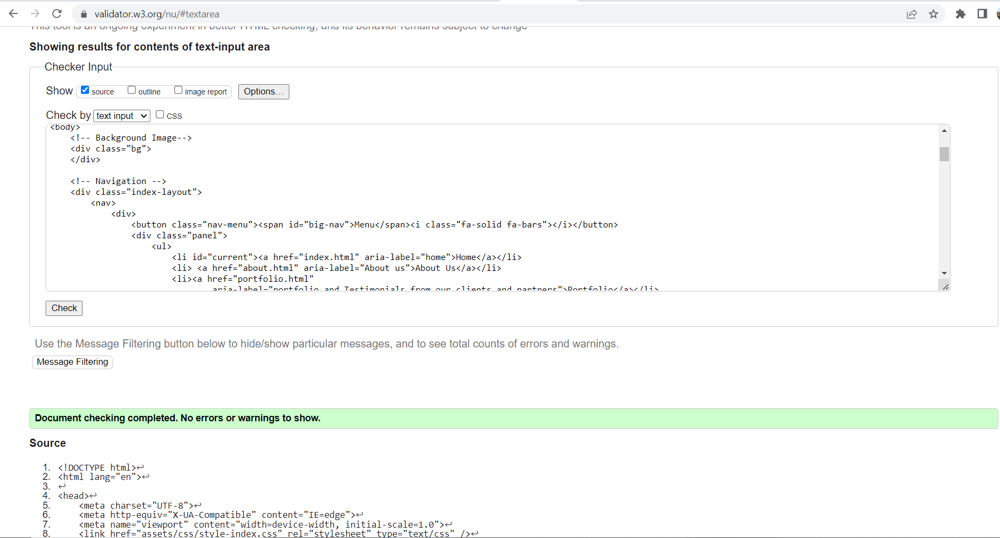 

#### css
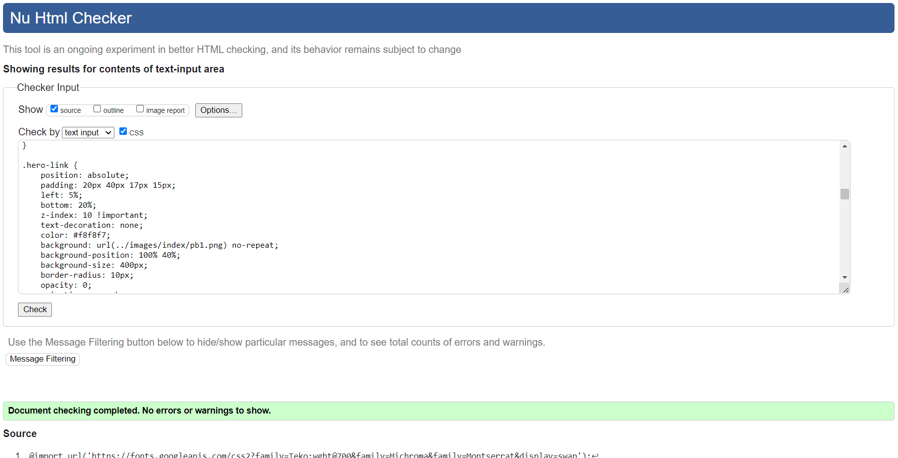 

### About 

#### html
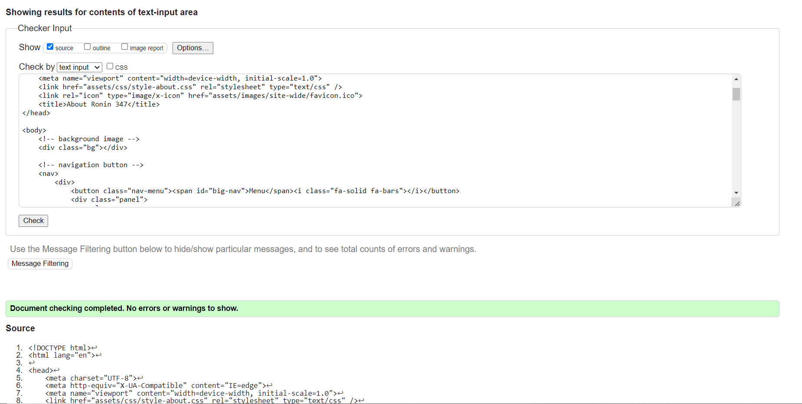 

#### css
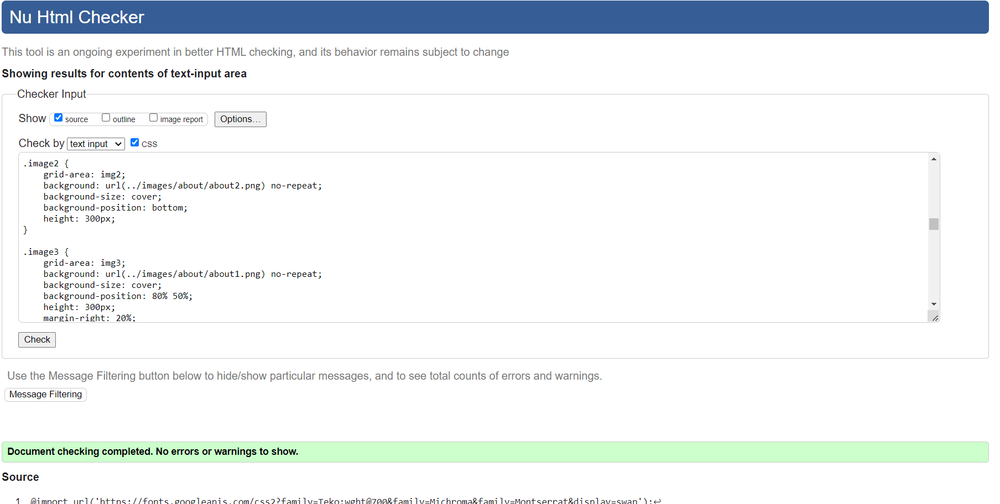 

### Portfolio 

#### html
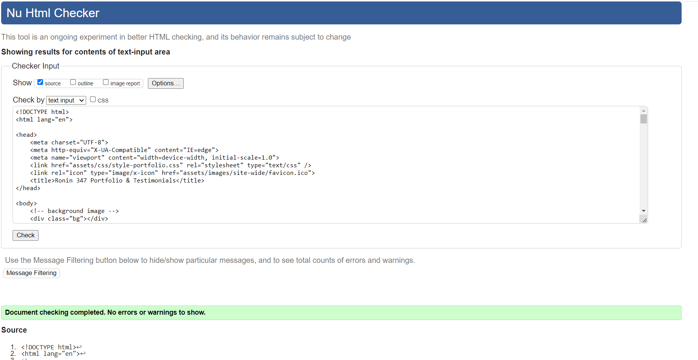 

#### css
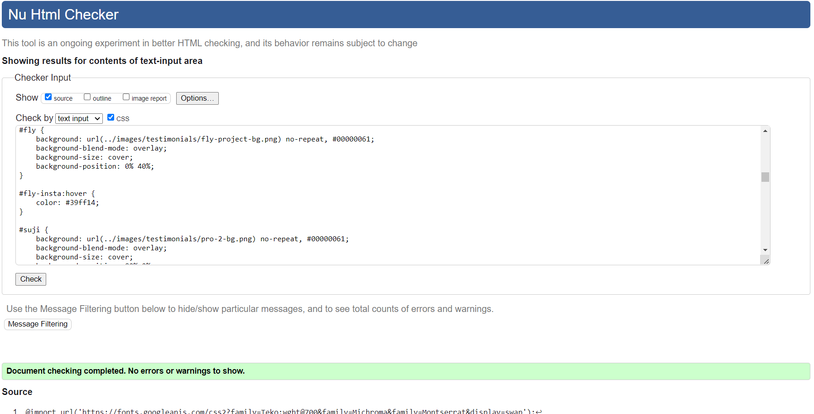 

### FAQ

#### html
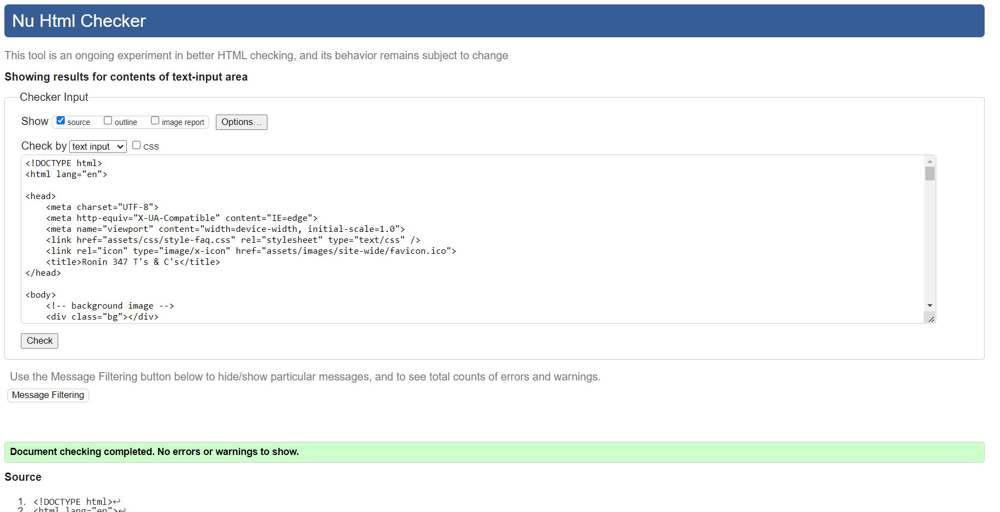 

#### css
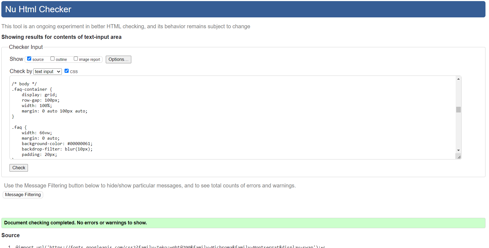 

### Contact 

#### html
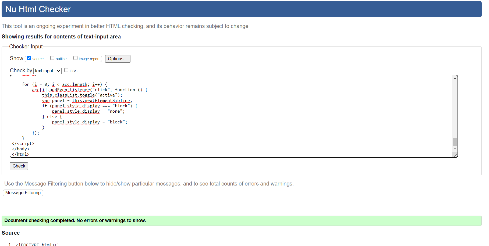 

#### css
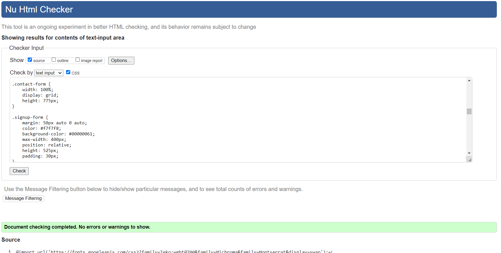 

### 404

#### html
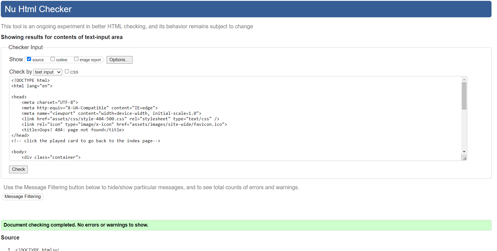 

#### css
 - as the pages 404 and 500 share the css, this image represents both
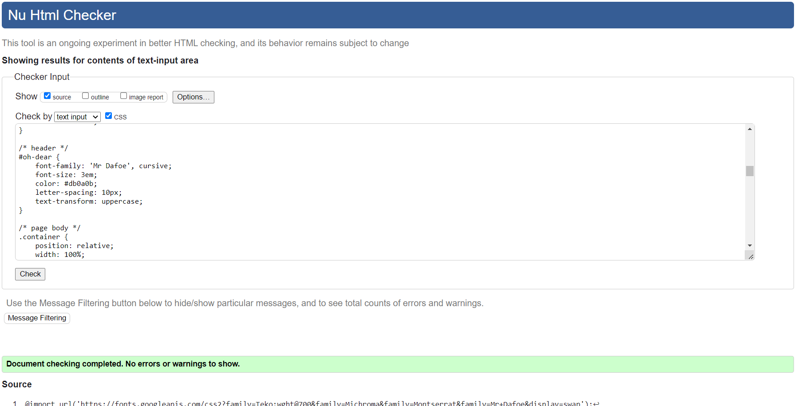 

### 500

#### html
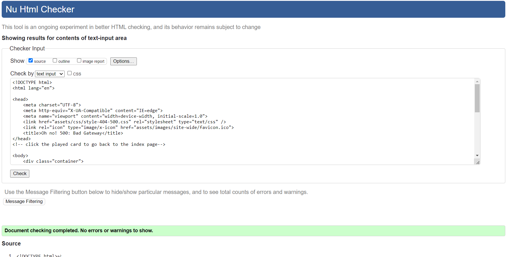 

## Browser Validation
Chrome: 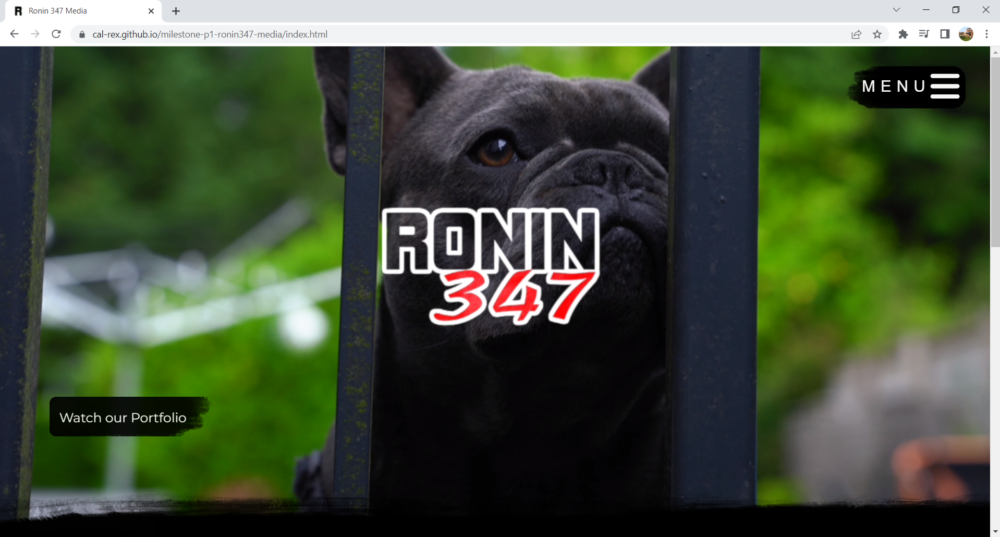
Firefox: 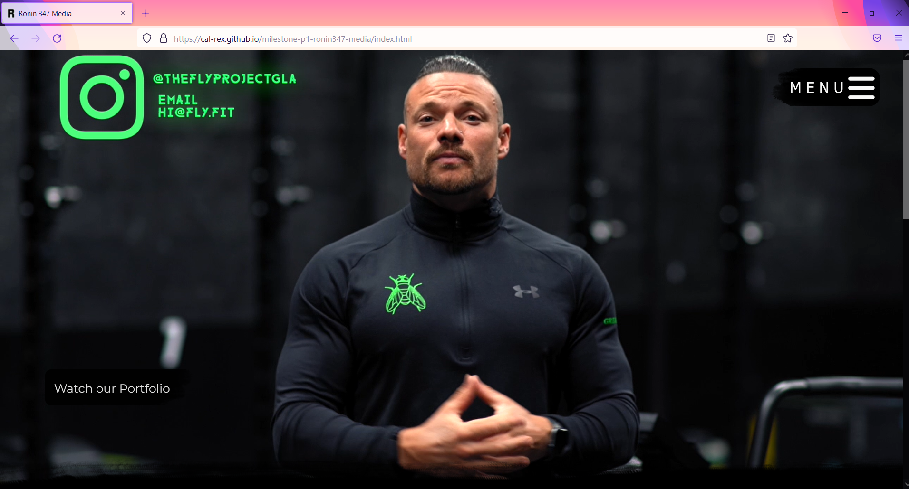 
Opera: 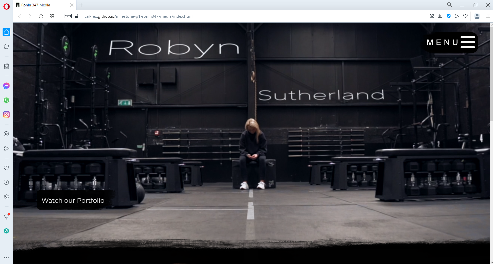 
MS Edge: 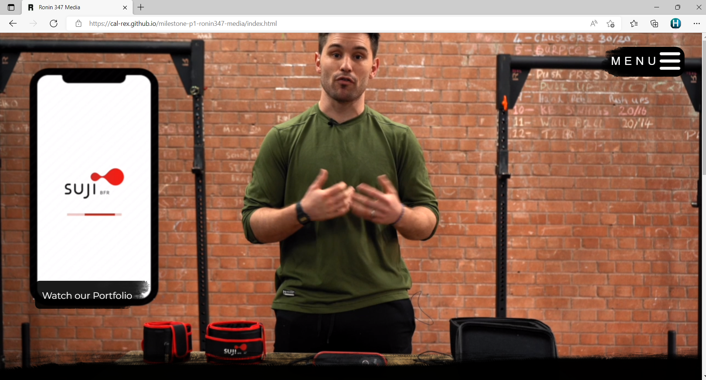 
Chrome mobile: 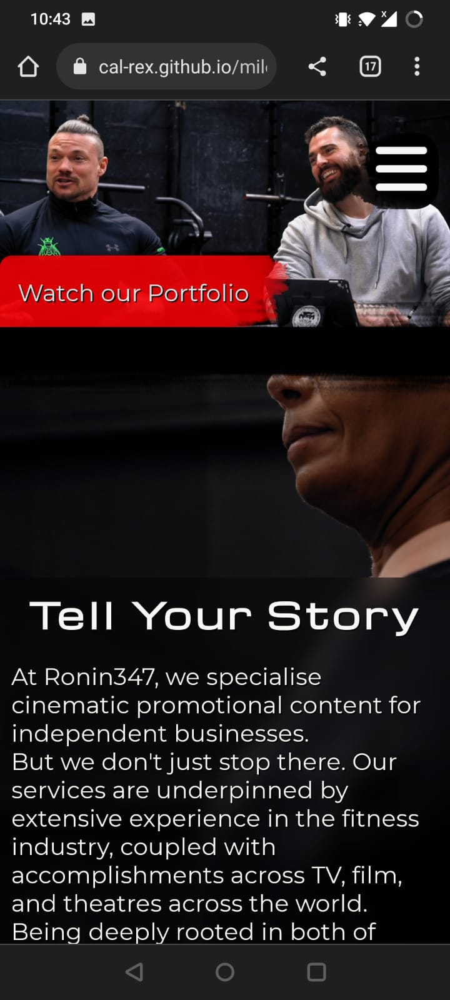
Safari mobile: 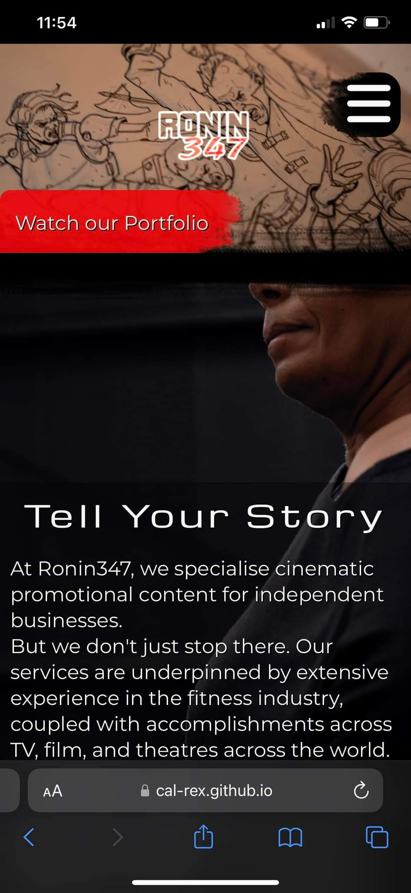 

## User Testing
Special thanks to the following individuals took the time to meticulously go through the site and and give me excellent feedback
- Sarah Breen
- Gemma Hamill
- Chris Williams
- Daniel Cahill
- Omercan Cirit
- Seun Owonikoko
- Christina Myrvold
- Andrea Marshall

Also, a big thank you to Everyone In the Code Institute Slack who took the time to have a look at my project 